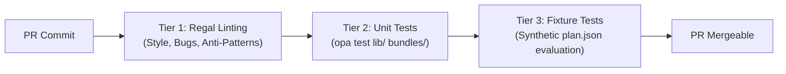

# Terrakube OPA Policy Monorepo Scaffolding & CI/CD Guide

This guide establishes the production-grade repository layout, testing frameworks, linting rules, and CI/CD promotion workflows for managing Open Policy Agent (OPA) guardrails at scale in Terrakube.

---

## 1. Monorepo Directory Layout

Enterprises should maintain a centralized Git repository (e.g. `https://github.com/enterprise/terrakube-policies`) organized by domain bundles, shared libraries, and test fixtures:

```text
terrakube-policies/
├── .github/
│   └── workflows/
│       ├── policy-ci.yaml              # 3-tier PR verification pipeline
│       └── policy-release.yaml         # Semantic Versioning & tagging
├── .regal/
│   └── config.yaml                     # Regal linting rules & severity thresholds
├── Makefile                            # Developer workflow automation
├── bundles/                            # OPA Policy Sets referenced in Terrakube
│   ├── common/
│   │   └── blast_radius/
│   │       ├── blast_radius.rego       # Rules limiting destroy / blast radius
│   │       └── blast_radius_test.rego  # Unit test assertions
│   ├── azure/
│   │   ├── tagging/
│   │   │   ├── tagging.rego            # Mandatory tag enforcement
│   │   │   └── tagging_test.rego
│   │   └── networking/
│   │       ├── apim_private.rego       # Private endpoint enforcement
│   │       └── apim_private_test.rego
│   └── aws/
│       └── s3_encryption/
│           ├── s3_encryption.rego
│           └── s3_encryption_test.rego
├── lib/                                # Shared reusable Rego functions
│   ├── terraform.rego                  # Plan traversal & resource diff helpers
│   └── tags.rego                       # Standard tag extraction & validation
└── fixtures/                           # Synthetic mock inputs for integration tests
    └── plans/
        ├── pass_compliant_stack.json
        ├── fail_missing_tags.json
        └── fail_apim_public_network.json
```

---

## 2. Standard Rego Policy Contract

Terrakube evaluates policy bundles by querying standard rule sets defined in package namespace `terrakube`:

```rego
package terrakube

import data.lib.terraform

default allow = false

# Hard mandatory rule: Plan is rejected unless all deny rules evaluate to empty
allow {
    count(deny) == 0
}

# 1. Hard Mandatory Violations (Blocks plan and halts execution)
deny[msg] {
    resource := terraform.resources("azurerm_api_management")[_]
    resource.change.after.public_network_access_enabled == true
    msg := {
        "rule_id": "azure_apim_no_public_network",
        "resource": resource.address,
        "message": "Azure API Management instances must disable public network access.",
        "fix": "Set public_network_access_enabled = false and configure private endpoints."
    }
}

# 2. Soft Mandatory Violations (CLI/UI interactive override allowed for authorized teams)
soft_mandatory[msg] {
    deletions := terraform.deleted_resources
    count(deletions) > 10
    msg := {
        "rule_id": "enterprise_blast_radius_deletion_limit",
        "resource": "plan",
        "message": sprintf("Plan deletes %d resources, exceeding threshold of 10.", [count(deletions)]),
        "fix": "Reduce deletion scope or request SecOps team override."
    }
}

# 3. Advisory Warnings (Non-blocking informational notifications)
warn[msg] {
    resource := terraform.resources("azurerm_storage_account")[_]
    not resource.change.after.tags.CostCenter
    msg := {
        "rule_id": "azure_storage_missing_cost_center",
        "resource": resource.address,
        "message": "Storage account missing optional CostCenter tag.",
        "fix": "Add CostCenter tag to storage account."
    }
}
```

---

## 3. 3-Tier CI Quality Gates

Every Pull Request to the policy repository must pass 3 independent verification tiers before merging:



### Tier 1: Regal Linting
[Regal](https://github.com/StyraInc/regal) catches syntax anti-patterns, shadowed variables, unassigned references, and algorithmic performance bottlenecks.

Configuration (`.regal/config.yaml`):
```yaml
rules:
  bugs:
    rule-shadows-builtin:
      level: error
  style:
    avoid-empty-lines:
      level: warning
    line-length:
      max-line-length: 120
      level: warning
  idiomatic:
    custom-has-key-construct:
      level: error
```

Run command:
```bash
regal lint bundles/ lib/
```

### Tier 2: Unit Testing (`opa test`)
Verify helper functions and individual rule packages against mock Rego inputs:

```rego
package terrakube

test_deny_public_apim {
    mock_input := {
        "resource_changes": [{
            "type": "azurerm_api_management",
            "address": "azurerm_api_management.gateway",
            "change": {"after": {"public_network_access_enabled": true}}
        }]
    }
    violations := deny with input as mock_input
    count(violations) == 1
}

test_allow_private_apim {
    mock_input := {
        "resource_changes": [{
            "type": "azurerm_api_management",
            "address": "azurerm_api_management.gateway",
            "change": {"after": {"public_network_access_enabled": false}}
        }]
    }
    violations := deny with input as mock_input
    count(violations) == 0
}
```

Run command:
```bash
opa test lib/ bundles/ -v
```

### Tier 3: Synthetic Plan Fixture Tests
Assert that full Terraform plan JSON documents evaluate with exact expected violation counts:

```bash
# Assert that compliant stack passes with 0 violations
opa eval -d bundles/ -d lib/ -i fixtures/plans/pass_compliant_stack.json "data.terrakube.allow" --format raw | grep "true"

# Assert that non-compliant stack fails with expected rule
opa eval -d bundles/ -d lib/ -i fixtures/plans/fail_apim_public_network.json "data.terrakube.deny" | grep "azure_apim_no_public_network"
```

---

## 4. GitHub Actions CI Pipeline (`.github/workflows/policy-ci.yaml`)

```yaml
name: Policy CI & Verification

on:
  pull_request:
    branches: [main]
  push:
    branches: [main]

jobs:
  verify:
    runs-on: ubuntu-latest
    steps:
      - name: Check out repository
        uses: actions/checkout@v4

      - name: Install OPA
        run: |
          curl -L -o /usr/local/bin/opa https://github.com/open-policy-agent/opa/releases/download/v1.20.2/opa_linux_amd64_static
          chmod +x /usr/local/bin/opa
          opa version

      - name: Install Regal
        run: |
          curl -L -o /usr/local/bin/regal https://github.com/StyraInc/regal/releases/latest/download/regal_Linux_x86_64
          chmod +x /usr/local/bin/regal
          regal version

      - name: Tier 1: Regal Linting
        run: regal lint bundles/ lib/

      - name: Tier 2: OPA Unit Tests
        run: opa test lib/ bundles/ -v --coverage --threshold 85

      - name: Tier 3: Synthetic Plan Fixture Tests
        run: |
          echo "Testing Compliant Fixture..."
          opa eval -d bundles/ -d lib/ -i fixtures/plans/pass_compliant_stack.json "data.terrakube.allow" --format raw | grep "true"
          echo "Testing APIM Violation Fixture..."
          opa eval -d bundles/ -d lib/ -i fixtures/plans/fail_apim_public_network.json "data.terrakube.deny" | grep "azure_apim_no_public_network"
```

---

## 5. Staged Fleet Rollout with `terraform-provider-terrakube`

Once policies are validated in CI and tagged with a SemVer release tag (e.g. `v2.1.0`), manage fleet rollout across environments using `terrakube_policy_set`:

```terraform
# Staging Fleet (canary testing against release candidates or main branch)
resource "terrakube_policy_set" "staging_policies" {
  organization_id   = var.staging_org_id
  name              = "baseline-guardrails"
  enforcement_level = "hard_mandatory"
  global            = true

  repository = "https://github.com/enterprise/terrakube-policies.git"
  branch     = "v2.2.0-rc1"
  folder     = "bundles/common"
}

# Production Fleet (pinned to stable verified SemVer tags)
resource "terrakube_policy_set" "production_policies" {
  organization_id   = var.prod_org_id
  name              = "baseline-guardrails"
  enforcement_level = "hard_mandatory"
  override_team     = "secops-approvers"
  global            = true

  repository = "https://github.com/enterprise/terrakube-policies.git"
  branch     = "v2.1.0"
  folder     = "bundles/common"
}
```
